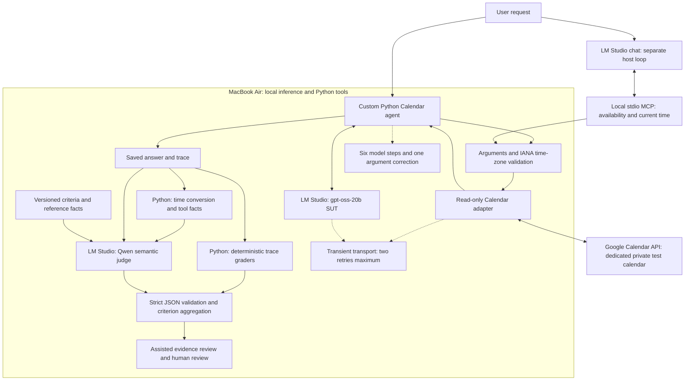

# Agentic AI Quality & Test Harness — current architecture

Current v0.2 Development Preview, October 8, 2026. The implemented SUT checks Calendar availability; event creation is future work.

## Runtime and evidence flow

Model inference is local; Calendar reads connect to Google. Load SUT and judge in turn on the 32 GB Mac. Model weights remain outside Git. Configure `SUT_MODEL`, `JUDGE_MODEL` and `LM_STUDIO_BASE_URL`; the endpoint must remain loopback for this preview.

The judge receives saved answers, tool observations and grading criteria. It does not call Calendar or receive OAuth credentials. Its request transport remains single-attempt. Invalid output is UNCERTAIN; valid JSON does not guarantee a correct verdict.

The MCP host owns a separate loop. It shares the read-only Calendar implementation and network retry policy, but the Python agent's conversation-wide correction limit does not control LM Studio chat. See [RETRY_POLICY.md](RETRY_POLICY.md).

## Three testing layers

| Layer | Execution | Evidence and limits |
|---|---|---|
| Deterministic | Scripted model responses and simulated APIs | 108 tests; loop, validation, time zones, retries, judge schema and grading logic |
| Integration | Real Google Calendar reads | Manual live read-only evidence on the dedicated calendar; separate from controlled evaluations |
| Agent evaluation | Real local SUT with controlled Calendar fixtures | 15 cases, structural checks, saved answers and pending semantic review |

Saved answers also pass through local LLM judging and assisted/human evidence review. The v7 focused check matched three development expectations; it is not held-out accuracy or release approval. A new 15-case controlled SUT evaluation completed after those changes with 14/15 strict structural passes and one successful correction. Full v7 judge scoring completed with 15 valid outputs, 11 raw PASS / 4 FAIL; human semantic review remains pending. Full v10 baseline is not yet run.

## Repository and migration

`src/`, `tests/` and `evals/` contain portable code and definitions. `reports/baseline/` holds selected evidence; `reports/runs/` holds ignored routine outputs. Keep secrets and OAuth files outside the repository. Recreate `.venv` and reinstall LM Studio/models on the Mac Studio; reauthenticate Google rather than copy tokens.

Current doctor lists models through the local API. Dependency locking, checks for both model roles and Google connectivity, and a complete clean-machine rebuild remain pending.

Event creation, a confirmation gate and duplicate-write handling are deferred. See [scope](PROJECT_SCOPE.md), [current status](SETUP_STATUS.md) and [baseline index](reports/baseline/README.md).

## View in VS Code

Press `Cmd+Shift+V`, or `Cmd+K` followed by `V` for a side preview. Mermaid-capable Markdown preview support is required.

## Computed trace facts for answer review

As of rubric v10, Python derives offset-aware UTC and query-timezone event intervals, timezone labels, strict overlap and recorded request count from saved traces. Qwen receives these facts and judges semantic answer claims against them. Unsupported or missing evidence stays unknown. The JSON report preserves computed facts and grader provenance; trace facts are not independent live-network verification. Archived rubrics retain their original context. See [v10 design](evals/JUDGE_V10_TRACE_FACTS.md).

## Overall verdicts versus individual checks

An overall verdict match is one piece of evidence, not proof of Judge reliability. Inspect each criterion, its evidence and the relationship between its reason and label. An overall FAIL may be correct because one check catches a defect while another misses it. Strict JSON validates structure; it does not validate meaning. Do not silently rewrite labels, tune on the validation result or retry until green.

The frozen v10 fresh-case run matched 3/4 authored overall labels and 31/36 criterion labels, including a false FAIL whose own reason concluded PASS. Criterion boundaries also overlap in the Judge's interpretation. Keep labels provisional, inspect FAIL/UNCERTAIN, and sample PASS. See [preserved evidence](reports/baseline/JUDGE_V10_FRESH_REVIEW.md). This checkpoint does not establish independent benchmark accuracy or human signoff.
