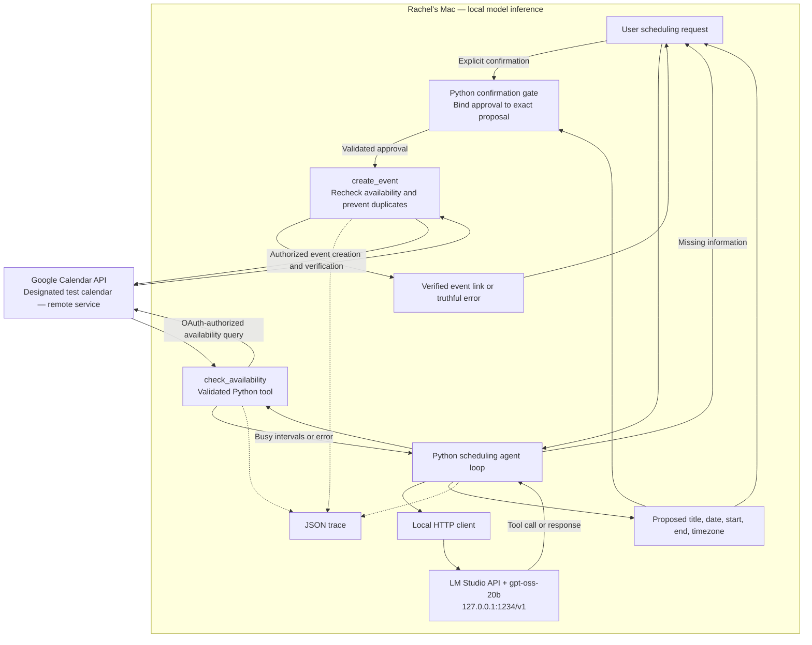
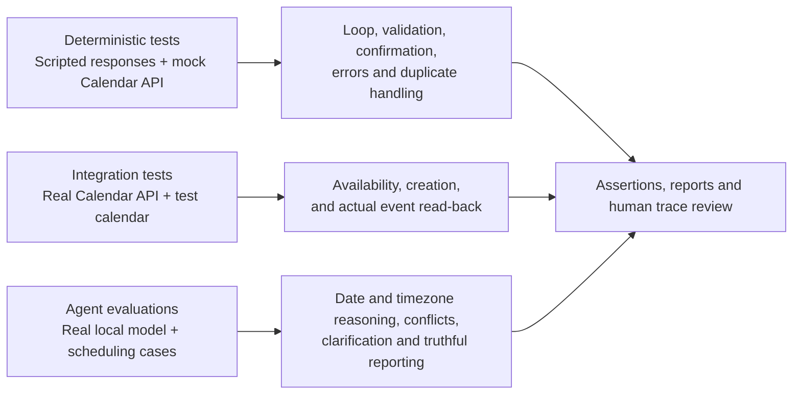

# Agentic AI Quality & Test Harness — Calendar Assistant

Approved target architecture, October 5, 2026. Read-only Calendar agent and availability tool are implemented and verified in one live local-model run. Event creation and its confirmation gate below are planned.

## Target architecture

The model proposes actions; Python validates and executes them. The confirmation gate is application logic, not merely a prompt. Local inference does not make Google Calendar offline. One model artifact remains outside the repository in `~/.lmstudio/models`.

## Quality harness

Live write tests require explicit test authorization and use only the configured test calendar. An evaluation should not create personal events silently. Mock tests remain useful for controlled failures and repeatable checks.

## Current implementation versus target

| Component | Status |
|---|---|
| Python environment, Git, VS Code | Prepared |
| LM Studio and one gpt-oss-20b model | Loaded and local chat verified |
| Local API and Python connection | Verified |
| Original QA loop and two mock tools | Implemented; real model tool flow verified |
| Existing deterministic tests | 41 passed: 21 QA + 16 Calendar tool + 4 Calendar agent tests |
| Existing QA evaluation cases | 15 prepared; not Calendar coverage |
| Google OAuth and Calendar tools | Read-only OAuth, check_availability, and local-model Calendar loop verified; creation planned |
| Confirmation and duplicate handling for Calendar | Not implemented |
| Calendar integration tests and evaluations | Not implemented |

See [PROJECT_SCOPE.md](PROJECT_SCOPE.md) for acceptance criteria and [SETUP_STATUS.md](SETUP_STATUS.md) for verification history.

## View in VS Code

Open this file and press `Cmd+Shift+V`, or `Cmd+K` followed by `V` for a side preview. Mermaid-capable Markdown preview support is required.
