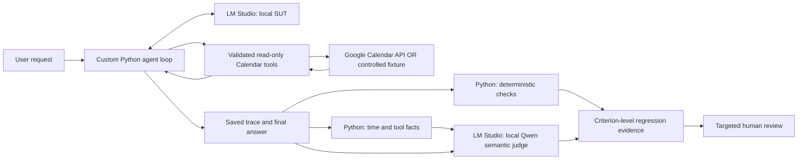

# Rachel’s Agentic AI Quality & Test Harness

[](https://github.com/rachelwuw/agentic-ai-quality-harness/actions/workflows/deterministic-tests.yml)

**Status: v0.2 Development Preview**

**Testing the reliability of LLM-powered agents and their evaluators**

The **Calendar Availability Agent** is a local, read-only assistant that checks whether a requested time slot is free on a dedicated test calendar. Its Python quality harness verifies tool execution and program logic, then supports review of answer quality through saved traces, deterministic checks and an advisory LLM judge. The project demonstrates Software Quality, Test Automation and Agentic AI Evaluation through inspectable evidence; it does not establish semantic accuracy or production reliability.

The assistant is **read-only** and queries a dedicated private test calendar. Event creation is future work. The local judge is **advisory**; it is not release signoff. Controlled evaluations use **simulated Calendar fixtures** with a real local SUT model.

## Demo: tool success is not always answer success

- **cal-04, successful availability answer:** an interval ending when a busy event begins is available. The tool result and final answer agree.
- **cal-08, failure analysis:** correct tool arguments and a “busy” result, but the answer incorrectly claims a displayed Los Angeles interval was converted to Taipei time.

[View requests, exact tool arguments/results and saved final answers](docs/DEMO.md). Both examples use controlled simulated Calendar responses. They contain no private live Calendar data.

## Key Findings

- **Tool execution success does not guarantee a correct answer.** [cal-08 saved demo](docs/DEMO.md#cal-08-failure-correct-tool-use-misleading-conversion-claim) has correct tool arguments and a supported busy result, but its final answer falsely claims the displayed Los Angeles event time was converted to Taipei.
- **Overall judge verdicts can hide criterion-level errors.** [v10 fresh summer-negative review](reports/baseline/JUDGE_V10_FRESH_REVIEW.md#criterion-disagreements-preserved) records an overall FAIL that matches the authored expectation while c2 misses a contradictory time claim.
- **Python-derived time facts support semantic review, but do not eliminate judge mistakes.** [v10 fresh winter-positive review](reports/baseline/JUDGE_V10_FRESH_REVIEW.md#criterion-disagreements-preserved) preserves a false FAIL despite computed time facts; the c6 reason concludes it should PASS while the label remains FAIL.

## Three testing layers

| Layer | What it checks | Dependencies / evidence |
| --- | --- | --- |
| Deterministic pytest | Loop bounds, allowed tools, argument validation, time zones, error handling, trace facts and judge output parsing | Scripted model responses and mock APIs; no model or Google calls. [Tests](tests/) |
| Live integration | Read-only adapter and OAuth against a dedicated test calendar | Real Google API; earlier manual checks, separate from controlled evaluations. [Status](SETUP_STATUS.md) |
| Agent evaluation | Real local SUT tool use and answers; deterministic trace checks plus semantic judge review | Simulated Calendar fixtures; saved traces, criterion judgments and targeted human review. [Evaluation guide](evals/CALENDAR_EVALUATIONS.md) |

## Latest saved evidence

| Evidence | Recorded scope / finding | Source / limits |
| --- | --- | --- |
| Deterministic tests | 143 passed in a recreated Python 3.12 environment, with no skips; current collection remains 143 | [Engineering verification](reports/baseline/ENGINEERING_CHECKPOINT_20261008.md), [test source](tests/). No Google or model inference; test count is not product accuracy. |
| Controlled agent cases | 15 completed with a real local SUT and simulated Calendar fixtures; structural recovery and answer defects are recorded separately | [SUT baseline review and raw trace](reports/baseline/CALENDAR_BASELINE_V7_RETRY_REVIEW.md). Semantic signoff remains pending. |
| Advisory judge evidence | Full v7 review exposes missed defects and false failures; focused v10 fresh cases expose criterion misses, boundary overlap and a reason/verdict contradiction | [Full judge baseline](reports/baseline/CALENDAR_JUDGE_V7_NEW_BASELINE_REVIEW.md), [v10 fresh-case review](reports/baseline/JUDGE_V10_FRESH_REVIEW.md). Versioned counts remain in those reports; agreement is not semantic accuracy. |
| Live integration | Separate manual read-only Google checks for overlap, adjacency and free slots on the dedicated test calendar | [Public setup summary](SETUP_STATUS.md). Availability conclusions were supported, but one answer omitted explicit scope; not an automated live suite. Private raw traces are excluded. |

A full v10 judge baseline and repeatability study have **not** been run. Authored expected labels and Codex-assisted reviews are distinct from Rachel’s human signoff. [Browse representative findings and the full evidence history](reports/baseline/README.md).

## Architecture



**Python establishes trace facts; Qwen interprets answer claims.** Python computes UTC/local conversions, date boundaries, interval overlap and recorded external-request counts. Qwen assesses contradictions and unsupported claims against that evidence. Missing facts stay unknown. Saved traces are not independent verification of network traffic.

An overall verdict match can hide incorrect criterion judgments. We preserve criterion disagreements and reason/verdict contradictions instead of treating a matching overall verdict as proof that the judge is reliable. [Architecture](ARCHITECTURE.md) · [v10 fact boundary](evals/JUDGE_V10_TRACE_FACTS.md).

## Quick start

Use Python 3.12+ and recreate the environment on each machine:

```sh
python3.12 -m venv .venv
source .venv/bin/activate
python -m pip install -e '.[dev,calendar,mcp]'
python -m pytest -q
```

Deterministic tests require no credentials or running model. Install LM Studio separately, configure the model IDs and loopback endpoint, then configure local Google OAuth for live read-only use:

```sh
export SUT_MODEL='openai/gpt-oss-20b'
export JUDGE_MODEL='qwen/qwen3.5-9b'  # use the identifier exposed by your runtime
export LM_STUDIO_BASE_URL='http://127.0.0.1:1234/v1'
python -m harness doctor
```

With the SUT loaded and Google authorization configured:

```sh
python -m harness.calendar_agent 'Check October 6, 2026, 10:00–10:30 AM in America/Los_Angeles on the test calendar.'
```

For the real local SUT with **simulated** Google responses:

```sh
python -m harness.calendar_evaluate --output reports/runs/calendar-evaluation.json
```

[Detailed runtime, OAuth, MCP and judge instructions](docs/LOCAL_SETUP.md). `.env.example` is a reference; the CLI does not automatically load it. Current doctor coverage and dependency locking are incomplete. Use new report paths; do not overwrite baselines or rerun until green.

## Limits and detailed documents

Calendar writes, event creation and production scheduling are not implemented. The judge still makes semantic mistakes; inspect FAIL/UNCERTAIN and sample PASS. Calibration and focused experiments are development evidence, not held-out accuracy. The complete clean-machine migration procedure remains unverified.

- [Scope and deferred functionality](PROJECT_SCOPE.md)
- [Evaluation cases and runner](evals/CALENDAR_EVALUATIONS.md), [judge guidance](evals/CALENDAR_JUDGE.md)
- [Proposed v11 boundary study: policy, cases and time estimate — not executed](evals/proposals/JUDGE_V11_REVIEW_PLAN.md)
- [Saved-input validation and deterministic CI](docs/SAVED_TRACE_VALIDATION.md)
- [Retry policy](RETRY_POLICY.md): bounded retries; judge requests remain single-attempt
- [Setup and hardware/migration](docs/LOCAL_SETUP.md), [local source control](SOURCE_CONTROL.md)
- [Baseline history](reports/baseline/README.md), [change log](CHANGELOG.md)

Commit source, tests, evaluation definitions and selected sanitized baselines. Exclude virtual environments, caches, model weights, secrets/OAuth files and disposable `reports/runs/`. No LangGraph, RAG, vector database, Jenkins or complex CI/CD is required.
