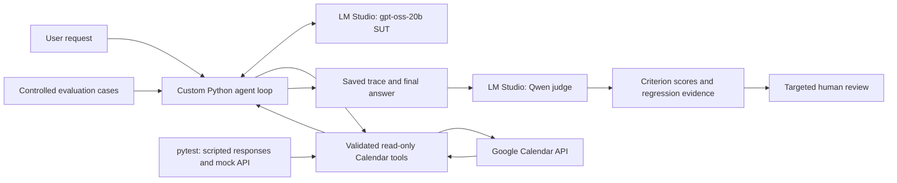

# Rachel's Agentic AI Quality & Test Harness

**Status: v0.1 Development Preview**

A small Python quality harness for a real Calendar Availability Assistant, with local models running in LM Studio. The project explores how to test tool selection, argument validation, time-zone handling, failure recovery and truthful final answers. It is a development checkpoint, not production-ready scheduling software.

Development machine: M5 MacBook Air, 32 GB RAM / 4 TB SSD. Future target: 64 GB Mac Studio.

## What works now

- Custom Python agent loop with tool allowlist, validated arguments, execution limit and JSON traces.
- Real read-only Google Calendar availability checks against a dedicated private test calendar.
- Optional MCP adapter for using the same Calendar tools in LM Studio chat.
- 96 deterministic pytest tests, run without Google or model inference.
- 15 controlled Calendar agent evaluation cases using the real local SUT model and simulated Calendar responses.
- Separate local Qwen judge that grades saved answers criterion by criterion using strict JSON output.
- Selected baseline reports and a documented assisted-review queue.

## Known limitations

- **Calendar writes are not implemented.** The assistant checks availability; it cannot create, reserve, modify or delete appointments. Scheduling with confirmed event creation is future work.
- **The judge makes mistakes.** The v5 full saved-answer review returned 11 PASS / 4 FAIL, but assisted review identified false failures and missed failures. Scores are provisional and require targeted human review and PASS sampling.
- **Calibration is a development set.** The 12-example v5 calibration matched all labels after tuning; eight labels are authored synthetic expectations pending human review. This is not held-out accuracy or release signoff.
- **Migration is not fully verified.** Configuration and Git layout support portability, but a complete clean-machine Mac Studio rebuild, dependency locking and expanded doctor checks remain pending.
- Real Calendar integration has manual live evidence; the controlled 15-case evaluation is not 15 live Google integration tests.

See [the 15-case review](reports/baseline/CALENDAR_REVIEW_V5.md) for known SUT failures and judge errors. Earlier failed runs remain preserved rather than replaced by passing results.

## Architecture



Model inference is local. Calendar reads connect to Google. The judge reads saved controlled traces and has no Calendar tools or Google credentials. LM Studio chat owns its own loop; the Python entry point is used for harness traces.

## Quick start

Use Python 3.12+ and recreate the virtual environment on each machine:

```sh
python3.12 -m venv .venv
source .venv/bin/activate
python -m pip install -e '.[dev,calendar,mcp]'
python -m pytest -q
```

`requirements-dev.txt` records the initial test environment; optional Calendar/MCP dependency ranges are in `pyproject.toml`. A complete dependency lock is still pending. Do not copy `.venv` to another Mac.

Install [LM Studio](https://lmstudio.ai/download), download/load the local SUT, and enable its loopback server. Keep model IDs configurable and use the IDs exposed by your runtime:

```sh
export SUT_MODEL='openai/gpt-oss-20b'
export JUDGE_MODEL='qwen/qwen3.5-9b'
export LM_STUDIO_BASE_URL='http://127.0.0.1:1234/v1'
python -m harness doctor
```

`.env.example` is a reference; the CLI does not automatically load `.env`. The current doctor checks runtime/model listing, not every migration prerequisite. Legacy `LM_MODEL` and `LM_BASE_URL` remain supported.

On this 32 GB Mac, load SUT and judge in turn rather than assuming both fit at once. Model weights remain on disk when unloaded. Historical Qwen judge baselines used an 8192-token context and Reasoning Budget 0. The saved Thinking experiment preset now uses a 1024-token budget; native requests select off/on explicitly and returned token counts verify whether reasoning occurred. See [the reasoning comparison](reports/baseline/JUDGE_REASONING_COMPARISON.md) for the matched experiment and its limitations.

## Google Calendar setup

Create a dedicated private test calendar, enable the Google Calendar API, and create a Desktop OAuth client. Store local files outside the repository in `~/.config/agentic-ai-quality-harness/`:

- `google-client.json`: OAuth client credentials.
- `calendar.json`: `{"calendar_id": "YOUR_TEST_CALENDAR_ID"}`; do not use `primary`.
- `google-readonly-token.json`: generated during authorization.

```sh
python -m harness.calendar_setup
```

Complete Google consent yourself. The scope `calendar.events.owned.readonly` permits reads on owned calendars; the application restricts its tool to the configured test calendar. Keep the calendar private and do not commit credentials/tokens. Reauthenticate on a new machine.

## Run the assistant

With the SUT loaded:

```sh
python -m harness.calendar_agent 'Check October 6, 2026, 10:00–10:30 AM in America/Los_Angeles on the test calendar.'
```

The agent uses local start/end values plus an IANA time zone; Python resolves UTC offsets and rejects nonexistent or ambiguous local times pending clarification. The low-level Calendar CLI accepts explicit RFC3339 instants. A completed loop means an answer was produced, not that its content is correct.

For LM Studio chat, configure a local stdio MCP server to run your recreated virtual environment's Python with arguments `-m harness.calendar_mcp`. Enable the integration and restart it after tool updates. Its tools are `check_availability` and `get_current_time`; adjust the Python path on each machine. See [LM Studio MCP documentation](https://lmstudio.ai/docs/app/mcp).

## Run evaluations and the judge

With the SUT loaded:

```sh
python -m harness.calendar_evaluate --output reports/runs/calendar-evaluation.json
```

This runs the real local model against controlled simulated Calendar evidence. It does not access Google. Structural success is separate from answer quality. See [evaluation guidance](evals/CALENDAR_EVALUATIONS.md).

Unload the SUT and load the configured Qwen judge, then:

```sh
python -m harness.calendar_judge --input evals/judge_calibration_cases.json --calibrate --output reports/runs/judge-calibration.json
python -m harness.calendar_judge --input reports/baseline/calendar-evaluation-post-fix-baseline.json --output reports/runs/calendar-judge.json
```

The judge computes independent criterion scores; Python aggregates them. Invalid/truncated output becomes UNCERTAIN. No automatic retries or rerun-until-pass. Inspect FAIL/UNCERTAIN and sample PASS. Full suite scoring is not autonomous signoff. See [judge guidance](evals/CALENDAR_JUDGE.md) and [calibration review](evals/JUDGE_CALIBRATION_REVIEW.md).

## Repository map

- `src/harness/agent.py`: shared custom loop.
- `calendar_agent.py`, `calendar_tools.py`, `calendar_mcp.py`: Calendar prompt, implementation and chat adapter.
- `calendar_evaluate.py`, `calendar_judge.py`: controlled evaluations and saved-answer grading.
- `tests/`: deterministic tests with scripted model responses and mock API.
- `evals/`: cases, criteria and calibration examples.
- `reports/baseline/`: selected controlled evidence, including known failures.
- `reports/runs/`: ignored routine outputs.
- `tools.py`, `evaluate.py`, `cases.json`: earlier QA mock prototype retained for learning/regression coverage.

## Source control and migration

Commit source, tests, evaluation definitions, project dependency files, docs and selected controlled baselines. Exclude `.venv`, caches, model weights, OAuth credentials/tokens, `.env` secrets and routine outputs. Never promote private live Calendar traces without reviewing their contents.

Migration path: Git clone → recreate Python environment → reinstall LM Studio → download models → configure secrets → authenticate Google → doctor → pytest/evals. Full end-to-end migration verification remains pending. See [local Git workflow](SOURCE_CONTROL.md), [architecture](ARCHITECTURE.md), [scope](PROJECT_SCOPE.md) and [current status/history](SETUP_STATUS.md).

No LangGraph, RAG, vector database, Jenkins or complex CI/CD is required for this preview. Judge reliability and read-only Calendar behavior remain the immediate quality focus.

The subsequent strict-JSON Thinking validation produced 6/6 valid outputs matching Rachel-confirmed synthetic labels, with observed reasoning in all six responses. This is a small configuration validation, not general accuracy or release approval. See [the report](reports/baseline/JUDGE_STRUCTURED_THINKING_VALIDATION.md).

Bounded transport retries and the Python Calendar agent correction budget are documented in [RETRY_POLICY.md](RETRY_POLICY.md). Judge requests remain single-attempt.
